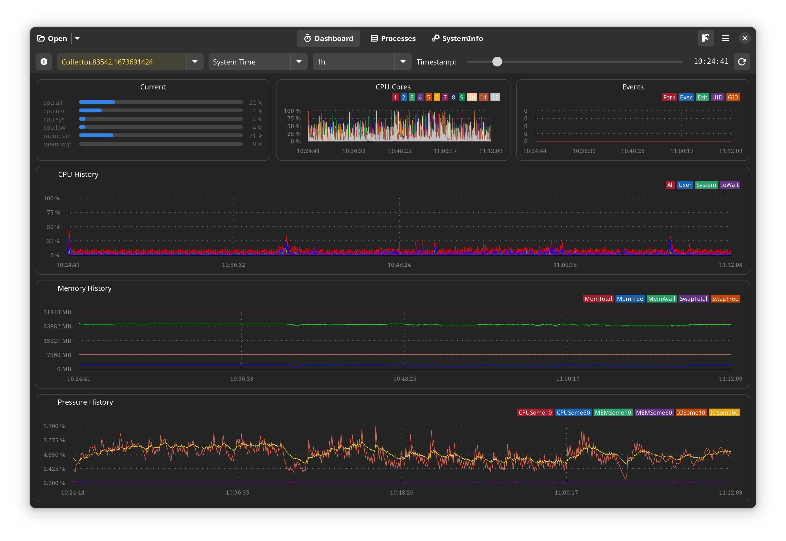

TaskMonitorViewer
=======

**TkmViewer** is grafical user interface to visualize output SQLite3 data format from taskmonitor daemon. Data can be collected from device using **tkm-reader**. For more details regarding the complete **TaskMonitor** please check https://gitlab.com/taskmonitor/taskmonitor.    

Flatpak builds
--------------

The recommended way of installing TkmViewer is through Flatpak. If you don't have
Flatpak installed, you can get it from [the Flatpak website](https://flatpak.org/setup).

You can install stable builds of TkmViewer from [Flathub](https://flathub.org)
by using this command:

    flatpak remote-add --if-not-exists flathub https://flathub.org/repo/flathub.flatpakrepo
    flatpak install flathub ro.fxdata.taskmonitor.viewer

Getting in touch
----------------
If you have questions about TkmViewer, you can contact me by email: alin.popa@fxdata.ro.

Code of conduct
---------------

TkmViewer follows the GNOME project [Code of Conduct](./code-of-conduct.md)

Copyright and licensing
-----------------------

Copyright 2022  Alin Popa <alin.popa@fxdata.ro>

TkmViewer is released under the terms of the GNU General Public License, either
version 3.0 or, at your option, any later version.

